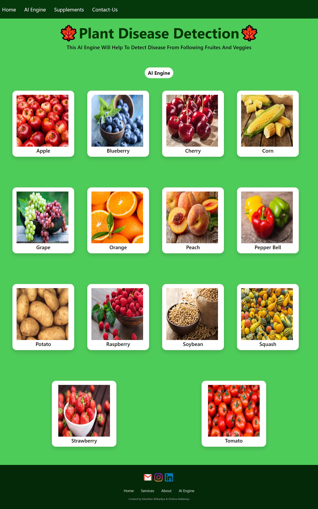
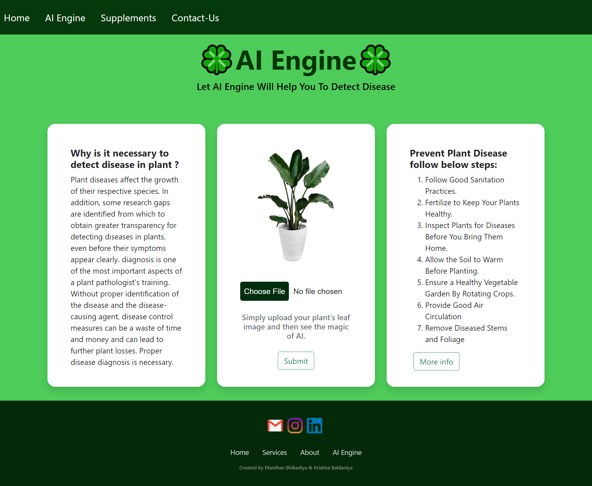

# Leaf Disease Detection System

An AI-driven agricultural tool designed to identify plant diseases from leaf images using deep learning. This project aims to help farmers detect crop issues early to ensure better yield and plant health.

## 🍃 Project Preview

### Analysis Workflow
| Step 1: Upload Image | Step 2: System Processing | Step 3: Disease Result |
|---|---|---|
|  |  |  |

### Dashboards & Analytics
| Statistical Overview | Model Data |
|---|---|
|  |  |

---

## 🚀 Key Features
* **Automated Identification:** Uses Convolutional Neural Networks (CNN) to classify leaf infections.
* **Instant Diagnosis:** Get immediate feedback after uploading a leaf photo.
* **Agricultural Insights:** Provides data-driven analytics on disease patterns.
* **User-Friendly Interface:** Built for ease of use by researchers and farmers alike.

## 🛠️ Technology Stack
* **Deep Learning:** TensorFlow / Keras
* **Image Processing:** OpenCV
* **Backend:** Python (Flask)
* **Frontend:** HTML5, CSS3, JavaScript

## 📦 How to Run
1. **Clone the repository:**
   ```bash
   git clone [https://github.com/Sweetha-B/Leaf-disease-detection.git](https://github.com/Sweetha-B/Leaf-disease-detection.git)
   pip install tensorflow opencv-python flask numpy
   python app.py
